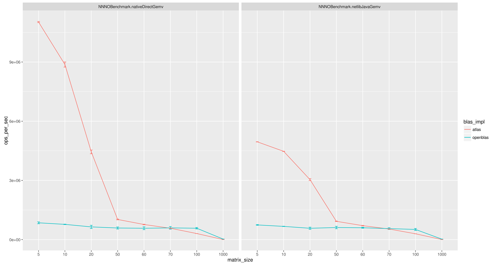
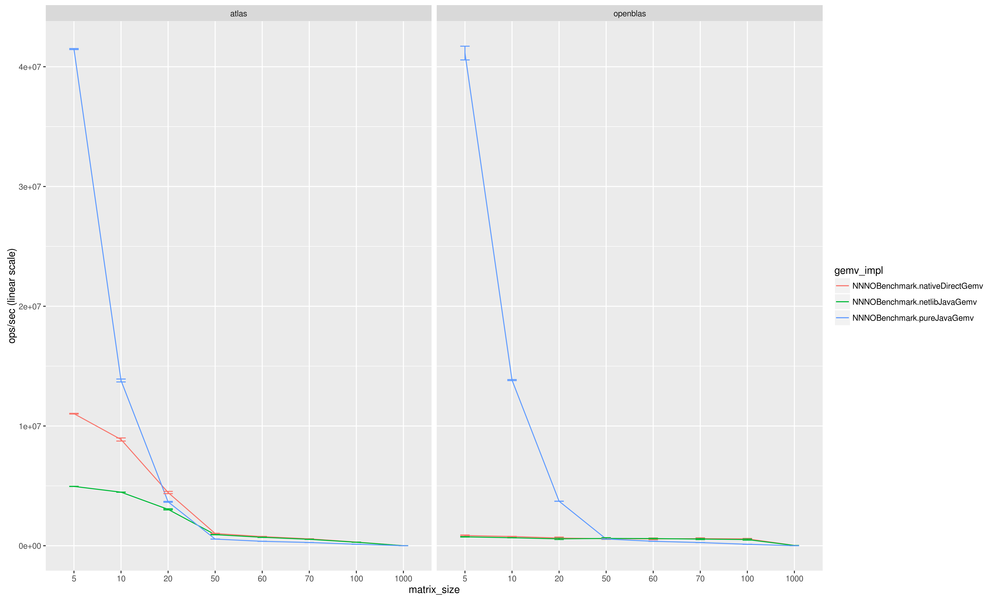
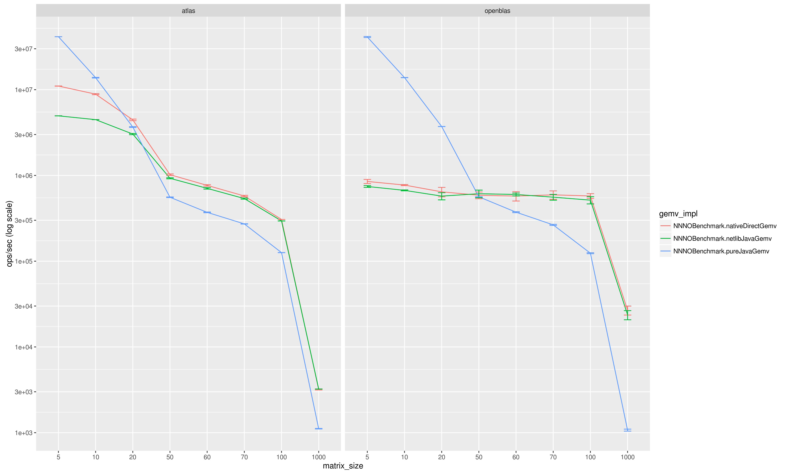

# OpenBLAS vs ATLAS

In this benchmark matrix-by-vector multiplication (SGEMV) was performed by both netlib-java and NNNO.
The actual multiplication was performed by either OpenBLAS or ATLAS. 

The main difference between netlib-java and NNNO is that:
- netlib-java uses `float` arrays and `GetPrimitiveArrayCritical()` JNI method. `GetPrimitiveArrayCritical()` allows for zero-copy data transfer between Java and native code, but calls `GC_locker::lock_critical(thread)` to avoid garbage collection.
- NNNO uses direct float buffers and `GetDirectBufferAddress()` JNI call

## Setup

Square float matrices of size: 5, 10, 20, 50, 60, 70, 100, 1000 were used.

## Results

### OpenBLAS
```
Benchmark                       (matrix size)  Mode  Cnt       Score       Error     Units
NNNOBenchmark.nativeDirectGemv             5  thrpt   15    851109.162 ±  47321.206  ops/s
NNNOBenchmark.nativeDirectGemv            10  thrpt   15    772219.856 ±  11278.684  ops/s
NNNOBenchmark.nativeDirectGemv            20  thrpt   15    644005.775 ±  81620.230  ops/s
NNNOBenchmark.nativeDirectGemv            50  thrpt   15    588103.429 ±  53434.125  ops/s
NNNOBenchmark.nativeDirectGemv            60  thrpt   15    574924.400 ±  71672.726  ops/s
NNNOBenchmark.nativeDirectGemv            70  thrpt   15    594085.776 ±  66681.669  ops/s
NNNOBenchmark.nativeDirectGemv           100  thrpt   15    576580.828 ±  36773.722  ops/s
NNNOBenchmark.nativeDirectGemv          1000  thrpt   15     26763.590 ±   3207.785  ops/s
NNNOBenchmark.netlibJavaGemv               5  thrpt   15    743624.328 ±  17851.916  ops/s
NNNOBenchmark.netlibJavaGemv              10  thrpt   15    669906.675 ±   7989.183  ops/s
NNNOBenchmark.netlibJavaGemv              20  thrpt   15    574331.523 ±  55134.322  ops/s
NNNOBenchmark.netlibJavaGemv              50  thrpt   15    612243.754 ±  62384.760  ops/s
NNNOBenchmark.netlibJavaGemv              60  thrpt   15    600043.087 ±  23058.395  ops/s
NNNOBenchmark.netlibJavaGemv              70  thrpt   15    557798.708 ±  43289.971  ops/s
NNNOBenchmark.netlibJavaGemv             100  thrpt   15    515422.367 ±  49751.404  ops/s
NNNOBenchmark.netlibJavaGemv            1000  thrpt   15     23643.560 ±   2891.803  ops/s
NNNOBenchmark.pureJavaGemv                 5  thrpt   15  41142969.399 ± 573986.560  ops/s
NNNOBenchmark.pureJavaGemv                10  thrpt   15  13834183.020 ±  43766.769  ops/s
NNNOBenchmark.pureJavaGemv                20  thrpt   15   3718186.820 ±   6009.733  ops/s
NNNOBenchmark.pureJavaGemv                50  thrpt   15    563076.165 ±   1630.797  ops/s
NNNOBenchmark.pureJavaGemv                60  thrpt   15    372743.811 ±   4850.909  ops/s
NNNOBenchmark.pureJavaGemv                70  thrpt   15    265087.962 ±   3813.974  ops/s
NNNOBenchmark.pureJavaGemv               100  thrpt   15    123910.559 ±   1593.308  ops/s
NNNOBenchmark.pureJavaGemv              1000  thrpt   15      1071.533 ±     28.827  ops/s
```


### ATLAS

```
Benchmark                       (matrix size)  Mode  Cnt       Score       Error     Units
NNNOBenchmark.nativeDirectGemv             5  thrpt   15  11027459.760 ±  28922.437  ops/s
NNNOBenchmark.nativeDirectGemv            10  thrpt   15   8872376.032 ± 130672.579  ops/s
NNNOBenchmark.nativeDirectGemv            20  thrpt   15   4445690.077 ±  94295.853  ops/s
NNNOBenchmark.nativeDirectGemv            50  thrpt   15   1020950.642 ±  20794.466  ops/s
NNNOBenchmark.nativeDirectGemv            60  thrpt   15    765704.938 ±  15240.666  ops/s
NNNOBenchmark.nativeDirectGemv            70  thrpt   15    575782.332 ±  10512.209  ops/s
NNNOBenchmark.nativeDirectGemv           100  thrpt   15    306696.087 ±    233.666  ops/s
NNNOBenchmark.nativeDirectGemv          1000  thrpt   15      3188.946 ±     38.789  ops/s
NNNOBenchmark.netlibJavaGemv               5  thrpt   15   4955126.766 ±   7335.172  ops/s
NNNOBenchmark.netlibJavaGemv              10  thrpt   15   4474026.981 ±   7053.063  ops/s
NNNOBenchmark.netlibJavaGemv              20  thrpt   15   3038753.767 ±  48393.955  ops/s
NNNOBenchmark.netlibJavaGemv              50  thrpt   15    926653.323 ±  12864.669  ops/s
NNNOBenchmark.netlibJavaGemv              60  thrpt   15    706819.111 ±  14202.167  ops/s
NNNOBenchmark.netlibJavaGemv              70  thrpt   15    537247.210 ±   8252.841  ops/s
NNNOBenchmark.netlibJavaGemv             100  thrpt   15    294833.352 ±    267.545  ops/s
NNNOBenchmark.netlibJavaGemv            1000  thrpt   15      3231.526 ±      3.693  ops/s
NNNOBenchmark.pureJavaGemv                 5  thrpt   15  41477222.574 ±  43026.234  ops/s
NNNOBenchmark.pureJavaGemv                10  thrpt   15  13799625.579 ± 122051.879  ops/s
NNNOBenchmark.pureJavaGemv                20  thrpt   15   3667116.063 ±  38305.613  ops/s
NNNOBenchmark.pureJavaGemv                50  thrpt   15    556507.504 ±   4761.427  ops/s
NNNOBenchmark.pureJavaGemv                60  thrpt   15    371084.011 ±   3740.425  ops/s
NNNOBenchmark.pureJavaGemv                70  thrpt   15    272071.644 ±   1146.361  ops/s
NNNOBenchmark.pureJavaGemv               100  thrpt   15    125886.132 ±    239.441  ops/s
NNNOBenchmark.pureJavaGemv              1000  thrpt   15      1112.551 ±      7.774  ops/s
```

### ATLAS vs OpenBLAS



### Netlib vs NNO vs pure Java SGEMV




## Summary

* For matrices with size smaller than 70, ATLAS outperforms OpenBLAS.
* For matrices with size smaller than 20, pure Java implementation outperforms ATLAS
* For matrices with size smaller than 50, pure Java implementation outperforms OpenBLAS
* NNNO is slightly faster than netlib-java. Especially when `GC_locker::lock_critical()` overhead is important (e.g. matrix size smaller than 50).
	* Therefore, direct float buffers used by NNNO seems to be faster than `GetPrimitiveArrayCritical()` used by netlib-java.


